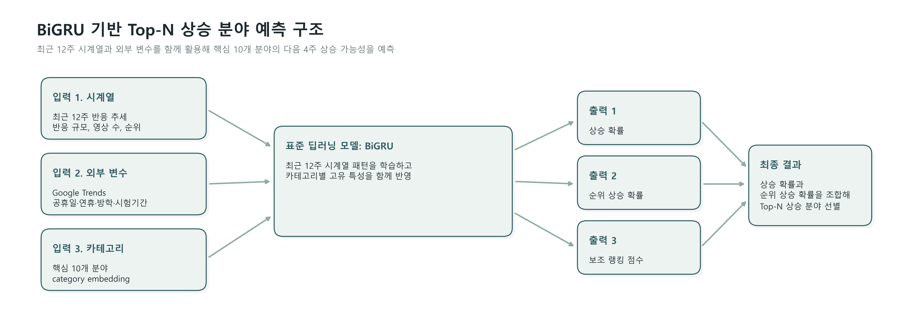

# FINAL MODEL

## 최종 모델 한 줄 설명

본 프로젝트의 최종 모델은 **RNN 계열의 표준 시계열 딥러닝 모델인 BiGRU를 기반으로, 유튜브 핵심 10개 분야의 향후 4주 상승 가능성을 예측하는 모델**입니다.

## 모델 구조 그림

입력으로는 최근 12주 시계열, Google Trends 검색량, 캘린더 변수, category embedding을 사용하고,  
출력으로는 상승 확률과 순위 상승 확률을 함께 산출한 뒤 최종 Top-5 상승 분야를 선별합니다.

## 왜 BiGRU인가

모델 선택 논리는 다음과 같습니다.

1. **RNN**
   - 순차 데이터를 시간 순서대로 처리하는 기본 구조
2. **GRU**
   - RNN의 장기 의존성 문제를 개선한 구조
3. **BiGRU**
   - GRU를 양방향으로 확장하여 시계열의 전후 문맥을 함께 학습하는 구조

유튜브 분야 추세는 단순히 한 주의 값만으로 설명되지 않고, 최근 12주 흐름 전체를 함께 봐야 합니다.  
따라서 본 프로젝트에서는 최근 시계열 패턴을 학습하기에 적합한 BiGRU를 최종 모델로 사용했습니다.

## 모델 입력

최종 모델 입력은 세 가지 축으로 구성됩니다.

### 1. 내부 시계열 입력

- 최근 12주 카테고리 반응 추세
- 평균 반응 규모
- 영상 수
- 참여도
- 순위
- 이동평균
- 변화율

### 2. 외부 변수 입력

- Google Trends 검색량
- 공휴일
- 연휴
- 방학
- 시험기간

### 3. 카테고리 정보

- category embedding

## 모델 출력

모델은 각 분야에 대해 아래 값을 산출합니다.

- 상승 확률 (`rise_probability`)
- 순위 상승 확률 (`rank_up_probability`)
- 보조 랭킹 점수 (`ranking_score`)

최종적으로는 이 값을 조합해 `final_score`를 계산하고, 이를 기준으로 Top-5 상승 분야를 선별합니다.

## 최종 점수 구성

코어 10개 최종 모델의 선택된 조합은 다음과 같습니다.

- `ranking_score = 0.0`
- `rise_probability = 0.4`
- `rank_up_probability = 0.6`

즉 최종 점수는 실질적으로

> `final_score = 0.4 × 상승 확률 + 0.6 × 순위 상승 확률`

로 해석할 수 있습니다.

## 평가 방식

최종 모델은 두 기준으로 평가했습니다.

### 분류 성능

- Accuracy
- Balanced Accuracy
- Precision
- Recall
- F1-score
- ROC AUC

### Top-5 선별 성능

- Precision@5
- Recall@5
- HitRate@5
- NDCG@5

이 프로젝트의 목적은 단순히 상승/비상승을 맞히는 것이 아니라, **어떤 분야를 상위에 둘 것인가**이기 때문에 Top-5 선별 성능이 특히 중요합니다.

## 해석 시 주의점

이 모델은 설명 가능한 선형 모델이 아닙니다.  
BiGRU 기반이기 때문에 내부 hidden representation은 여전히 블랙박스 성격이 있습니다.

따라서 이 모델은

- “완전한 해석형 모델”

이라기보다,

- “시계열 패턴을 학습하고, 상승 신호를 점수화하여 Top-5를 선별하는 모델”

로 이해하는 것이 맞습니다.

## 최종 해석

본 프로젝트의 최종 모델은 **유튜브 핵심 10개 분야 안에서, 향후 4주 동안 상대적으로 더 상승할 가능성이 높은 분야를 골라내는 BiGRU 기반 Top-5 선별 모델**입니다.
