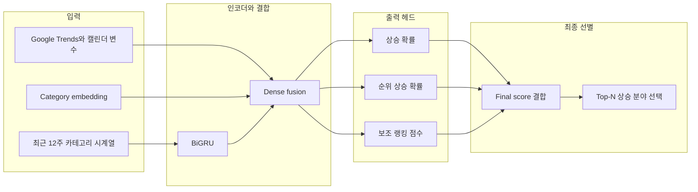

# 최종 모델 설명

본 프로젝트의 최종 모델은 핵심 10개 유튜브 분야를 대상으로, 최근 12주 시계열과 외부 변수를 바탕으로 다음 4주 동안 상승 가능성이 높은 Top-N 분야를 선별하는 BiGRU 기반 시계열 딥러닝 모델이다.

이 모델은 데이터 수집과 전처리, 파생변수 생성이 끝난 뒤 학습 단계에서 사용된다. 즉 원시 영상 데이터를 직접 받는 모델이 아니라, category-week 단위로 정리된 데이터를 입력으로 받아 분야별 상승 신호를 읽는 모델이다.

## 1. RNN 계열에서 BiGRU를 선택한 이유

발표에서 모델을 설명할 때 가장 자연스러운 흐름은 RNN에서 GRU, 그리고 BiGRU로 이어지는 구조를 보여 주는 것이다.

- RNN은 순차 데이터를 시간 순서대로 처리하는 기본 구조다.
- GRU는 RNN보다 장기 의존성 학습에 유리하면서 구조가 더 가볍다.
- BiGRU는 GRU를 양방향으로 확장해 짧은 시계열 안의 전후 문맥을 함께 읽을 수 있다.

이번 프로젝트는 최근 12주 흐름 안에서 상승, 둔화, 회복 신호를 함께 읽는 것이 중요했다. 또한 현재 데이터 규모에서는 지나치게 무거운 모델보다, 비교적 안정적으로 시계열 방향성을 학습할 수 있는 구조가 더 적합했다. 이런 이유로 RNN 계열 중 GRU를 바탕으로 하고, 전후 흐름까지 함께 반영할 수 있는 BiGRU를 최종 모델로 선택했다.

## 2. 모델이 해결하는 예측 문제

| 항목 | 내용 |
|---|---|
| 예측 단위 | 유튜브 핵심 10개 분야 |
| 입력 구간 | 최근 12주 |
| 예측 기간 | 다음 4주 |
| 최종 목표 | 상승 가능성이 높은 Top-N 분야 선별 |
| 최종 해석 | 인기 분야 반복이 아니라 상대적으로 더 올라갈 가능성이 있는 분야 선택 |

대상 10개 분야는 다음과 같다.

- 게임
- 경제
- 교육
- 뉴스시사
- 먹방
- 반려동물
- 뷰티
- 브이로그
- 요리
- 운동

## 3. 모델 입력 구성

모델 입력은 세 갈래로 이해하면 된다.

| 입력 축 | 내용 | 역할 |
|---|---|---|
| 내부 시계열 입력 | 최근 12주 카테고리 반응 추세, 평균 반응 규모, 영상 수, 참여도, 순위, 이동평균, 변화율 | 카테고리 내부 흐름과 모멘텀 학습 |
| 외부 변수 입력 | Google Trends 검색량, 공휴일, 연휴, 방학, 시험기간 등 캘린더 변수 | 내부 반응만으로 설명하기 어려운 외부 관심도 반영 |
| 카테고리 정보 | category embedding | 분야별 고유 구조와 반응 패턴 구분 |

즉 모델은 단일 수치만 보는 것이 아니라, 최근 반응 흐름과 외부 관심도, 카테고리 맥락을 함께 읽도록 설계되었다.

## 4. 모델 구조

이 구조에서 핵심은 세 가지다.

- 최근 12주 흐름은 BiGRU가 읽는다.
- 외부 변수와 카테고리 정보는 중간 결합 단계에서 함께 반영된다.
- 출력은 단일 점수가 아니라 여러 신호를 나눠 계산한 뒤 최종 순위를 정한다.

## 5. 파생변수와 모델의 연결

발표에서 설명한 파생변수들은 모델이 어떤 신호를 읽도록 설계되었는지를 보여 준다.

- `rolling_4week_mean`
  - 최근 흐름의 평균 수준
- `momentum_ratio`
  - 최근 반응 가속도
- `competition_score`
  - 같은 시점 다른 분야 대비 경쟁 강도
- `opportunity_score`
  - 상대적 상승 여력
- `rise_label`
  - 다음 4주 상승 여부
- `rank_up`
  - 다음 4주 순위 상승 여부

즉 이 모델은 단순히 지금 큰 분야를 고르는 것이 아니라, 최근 변화 방향과 상대 상승 신호를 함께 학습하도록 설계되었다.

## 6. 출력과 해석 기준

최종 모델은 아래 값을 산출한다.

| 출력 | 의미 |
|---|---|
| 상승 확률 | 해당 분야가 앞으로 상승할 가능성 |
| 순위 상승 확률 | 다른 분야 대비 순위가 더 올라갈 가능성 |
| 보조 랭킹 점수 | 최종 선별을 보정하는 추가 신호 |

그리고 이 값들을 조합해 최종적으로 Top-N 상승 분야를 선별한다. 따라서 이 모델은 단순 분류기라기보다, 상승 가능성을 점수화하고 상위권을 정렬하는 선별 모델에 더 가깝다.

## 7. 발표에서 이렇게 설명하면 자연스럽다

본 연구는 RNN 계열 모델 중 장기 의존성 학습에 유리한 GRU를 바탕으로 했고, 최근 12주 시계열의 전후 흐름을 함께 반영하기 위해 양방향 구조인 BiGRU를 최종 모델로 사용했다. 여기에 category embedding과 외부 변수를 결합해 각 분야의 상승 확률과 순위 상승 확률을 함께 예측하고, 이를 바탕으로 향후 4주 동안 상승 가능성이 높은 Top-N 분야를 선별하도록 설계했다.

## 한 문장 요약

이 프로젝트의 최종 모델은 최근 12주 카테고리 시계열, 외부 변수, category embedding을 함께 사용하는 BiGRU 기반 Top-N 상승 분야 예측 모델이다.