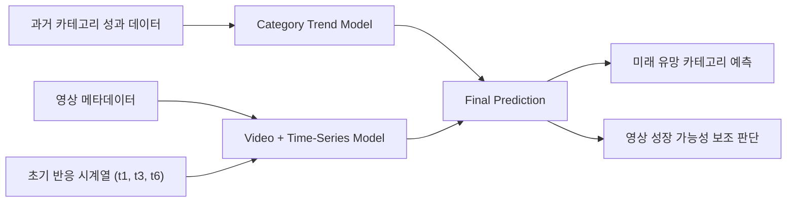

# 예측 모델 설계

최종 발표 자료 기준으로 이 프로젝트의 모델은 **카테고리 흐름과 영상 초기 반응을 함께 보는 예측 구조**로 설명하는 것이 가장 자연스럽다.

즉, 어떤 영상 하나만 따로 떼어 예측하는 것이 아니라,

- 카테고리 전체 흐름을 먼저 읽고
- 영상 메타데이터와 초기 시계열 반응을 함께 반영해
- 최종적으로 미래 관심도와 성장 가능성을 판단하는 방식이다.

## 발표 자료 기준 모델 구조

## 단계별 역할

### 1. 데이터 입력

입력은 크게 세 갈래다.

- **과거 카테고리 성과 데이터**
  - 장기 흐름과 기본 체력 반영
- **영상 메타데이터**
  - 제목, 태그, 업로드 시간 등 영상 특성 반영
- **초기 시계열 반응**
  - t1, t3, t6 기준 반응 속도와 초기 확산 신호 반영

### 2. Category Trend Model

이 단계의 역할은 **카테고리의 미래 관심도와 트렌드 방향**을 먼저 읽는 것이다.

즉,
- 어떤 분야가 원래 강한지
- 어떤 분야가 최근에 올라오는지
- 관심도가 유지되는지, 둔화되는지

를 카테고리 수준에서 먼저 판단한다.

### 3. Video + Time-Series Model

이 단계는 개별 영상 단위에서 **초기 반응의 속도와 성장 가능성**을 본다.

여기서 중요한 건 단순 누적 조회수가 아니라,

- 초기 반응 속도
- 반응 확산 패턴
- 메타데이터 맥락

을 함께 보는 것이다.

### 4. Final Prediction

마지막 단계에서는 카테고리 흐름과 영상 반응을 합쳐

- **미래 유망 카테고리**
- **영상 성장 가능성**

을 최종적으로 판단한다.

발표에서는 이 구조를 “카테고리 트렌드를 먼저 보고, 영상 반응을 보조적으로 결합하는 구조”로 설명하면 가장 무리 없다.

## 핵심 파생변수

발표 자료에서는 아래 네 가지를 핵심 변수 전략으로 제시했다.

### 1. Category Future Interest Score

- 카테고리의 미래 관심도 예측 점수
- 과거 트렌드를 기반으로 앞으로 얼마나 주목받을지를 정량화

### 2. Category Momentum

- 카테고리 상승/하락 속도 지표
- 최근 관심도 변화율을 반영해 트렌드의 상승세 여부를 측정

### 3. Early Interest Velocity

- 영상 초기 반응 속도 지표
- t1, t3, t6 기준 조회수 증가를 기반으로 초기 확산 속도를 정량화

### 4. Trend Alignment Score

- 카테고리와 영상 간 정렬 정도
- 영상 반응이 카테고리 트렌드와 얼마나 맞물리는지 평가

## 저장소 안 구현 실험과의 관계

이 저장소에는 발표 자료와 별개로, 프로젝트 진행 중 정리한 **추가 구현 실험 코드**도 함께 남아 있다.

대표적으로 [train_active_category_rank_bigru.py](./train_active_category_rank_bigru.py)는  
카테고리 시계열 예측 문제를 더 좁혀서 실험한 **BiGRU 기반 구현 버전**이다.

즉 이 저장소는 두 층으로 이해하면 된다.

1. **발표 자료 기준 구조**
   - Category Trend Model + Video + Time-Series Model + Final Prediction
2. **저장소 안 추가 구현 실험**
   - 시계열 중심의 BiGRU 기반 예측 실험

발표 자체는 첫 번째 구조를 중심으로 이해하고,  
저장소의 추가 코드와 문서는 그 뒤에서 진행한 확장 실험으로 보면 된다.

## 발표에서 이렇게 말하면 자연스럽다

가장 무리 없는 설명은 아래와 같다.

> 본 프로젝트는 개별 영상만 따로 예측하는 대신, 카테고리의 장기 흐름과 영상의 초기 반응을 함께 반영하는 구조로 설계하였다.  
> 먼저 카테고리 수준에서 미래 관심도와 트렌드 변화를 예측하고, 그 위에 영상 메타데이터와 초기 시계열 반응을 결합해 최종 관심도와 성장 가능성을 판단하는 방식이다.
