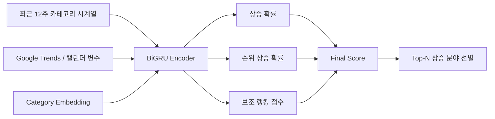

# 최종 모델 설명

최종 발표 기준으로 이 프로젝트의 모델은 **핵심 10개 분야 중 앞으로 4주 동안 상승 가능성이 높은 Top-N 분야를 선별하는 BiGRU 기반 딥러닝 모델**로 설명하는 것이 가장 정확하다.

이 모델은 단순히 개별 영상 하나의 조회수를 맞히려는 모델이 아니라,

- 카테고리의 최근 흐름을 읽고
- 외부 관심도와 캘린더 요인을 반영하고
- 분야별 고유 특성을 함께 고려해
- 최종적으로 상승 가능성이 높은 분야를 상위권에 배치하는 구조

로 이해하면 된다.

## 1. RNN → GRU → BiGRU

발표에서 모델을 설명할 때 가장 자연스러운 흐름은 아래와 같다.

- **RNN**
  - 순차 데이터를 시간 순서대로 처리하는 기본 구조
- **GRU**
  - RNN의 장기 의존성 문제를 완화하도록 게이트를 넣은 개선형 구조
- **BiGRU**
  - GRU를 양방향으로 확장해 시계열의 앞뒤 문맥을 함께 읽는 구조

이번 프로젝트는 최근 12주 흐름 안에서 **상승 조짐과 반응 패턴의 방향성**을 읽는 것이 중요했기 때문에, 최종 모델로 BiGRU를 선택했다.

## 2. 왜 BiGRU를 썼는가

이 프로젝트의 핵심은 현재 순간의 수치만 보는 것이 아니라,  
**최근 12주 시계열에서 장기 흐름과 최근 반응 패턴을 함께 읽는 것**이었다.

BiGRU는:

- 최근 12주 패턴을 순차적으로 학습할 수 있고
- 단순 RNN보다 장기 의존성 학습에 유리하며
- 양방향 구조를 통해 시계열의 전후 문맥을 함께 반영할 수 있다

는 점에서 이 문제에 적합했다.

즉, BiGRU는 “복잡해서” 고른 모델이 아니라,  
**짧은 주간 시계열 안의 맥락을 읽기 좋은 표준 딥러닝 모델**이라서 채택한 것이다.

## 3. 모델이 다루는 예측 문제

최종 문제 정의는 아래와 같다.

- **예측 단위**: 유튜브 핵심 10개 분야
- **입력 구간**: 최근 12주
- **예측 기간**: 다음 4주
- **최종 목표**: 상승 가능성이 높은 Top-N 분야 선별

대상 10개 분야는 다음과 같다.

- 게임
- 경제
- 교육
- 뉴스시사
- 먹방
- 반려동물
- 뷰티
- 브이로그
- 요리
- 운동

## 4. 모델 입력

입력은 세 갈래로 이해하면 된다.

### 4-1. 내부 시계열 입력

최근 12주 카테고리 반응 추세를 사용했다.

대표적으로:

- 평균 반응 규모
- 영상 수
- 참여도
- 순위
- 이동평균
- 변화율

같은 주간 반응 특성이 포함된다.

### 4-2. 외부 변수 입력

카테고리 내부 흐름만으로 설명하기 어려운 외부 요인을 반영하기 위해:

- Google Trends 검색량
- 공휴일
- 연휴
- 방학
- 시험기간

같은 캘린더성 변수를 함께 사용했다.

### 4-3. 카테고리 정보

분야마다 구조가 다르기 때문에 **category embedding**을 함께 사용했다.  
이를 통해 모델이 게임, 브이로그, 경제, 교육처럼 서로 다른 분야의 고유 특성을 구분할 수 있게 했다.

## 5. 모델 구조

발표 흐름 기준으로 모델은 아래처럼 설명할 수 있다.

핵심은:

- 시계열은 BiGRU가 읽고
- 외부 변수와 카테고리 정보는 함께 결합되며
- 출력은 단일 값이 아니라 여러 예측 헤드로 나뉜다는 점이다.

## 6. 출력과 예측 기준

최종 모델은 아래 값을 산출한다.

- **상승 확률**
- **순위 상승 확률**
- **보조 랭킹 점수**

그리고 이 값들을 조합해 최종적으로 **Top-N 상승 분야**를 선별한다.

즉, 이 모델은 단순 분류기라기보다  
**상승 가능성을 점수화하고 상위권을 정렬하는 선별 모델**에 더 가깝다.

## 7. 핵심 파생변수와의 연결

발표에서 설명한 파생변수들은 모델 입력이 어떤 문제를 풀도록 설계되었는지를 보여준다.

예를 들어:

- `rolling_4week_mean`
  - 최근 흐름의 평균 수준
- `momentum_ratio`
  - 최근 반응 가속도
- `competition_score`
  - 분야 내 경쟁 강도
- `opportunity_score`
  - 상대적 상승 가능성
- `rise_label`
  - 다음 4주 상승 여부
- `rank_up`
  - 다음 4주 순위 상승 여부

즉, 모델은 단순 수치 비교가 아니라 **최근 변화 방향과 상대 상승 신호**를 학습하도록 설계됐다.

## 8. 최종 성능

핵심 10개 분야 기준 최종 BiGRU 모델의 성능은 아래와 같다.

### 분류 성능

- Accuracy: `0.767`
- Balanced Accuracy: `0.798`
- Precision: `0.944`
- Recall: `0.739`
- F1-score: `0.829`
- ROC AUC: `0.845`

### Top-5 선별 성능

- Precision@5: `0.900`
- Recall@5: `0.801`
- HitRate@5: `1.000`
- NDCG@5: `0.881`

즉, 이 모델은 단순 상승/비상승 분류도 안정적이었고,  
무엇보다 실제 목적이었던 **상위 상승 분야 선별**에서 더 강한 성능을 보였다.

## 9. 발표에서 이렇게 설명하면 자연스럽다

가장 무리 없는 설명은 아래와 같다.

> 본 연구는 RNN 계열 모델 중 장기 의존성 학습에 유리한 GRU를 기반으로 하였고, 최근 12주 시계열의 앞뒤 문맥을 함께 반영하기 위해 양방향 구조인 BiGRU를 최종 모델로 사용하였다.  
> 여기에 category embedding과 외부 변수를 결합하여 각 분야의 상승 확률과 순위 상승 확률을 함께 예측하고, 최종적으로 향후 4주 동안 상승 가능성이 높은 Top-N 분야를 선별하도록 설계하였다.

## 한 문장 요약

이 프로젝트의 최종 모델은 **최근 12주 카테고리 시계열, 외부 변수, category embedding을 함께 사용하는 BiGRU 기반 Top-N 상승 분야 예측 모델**이다.
