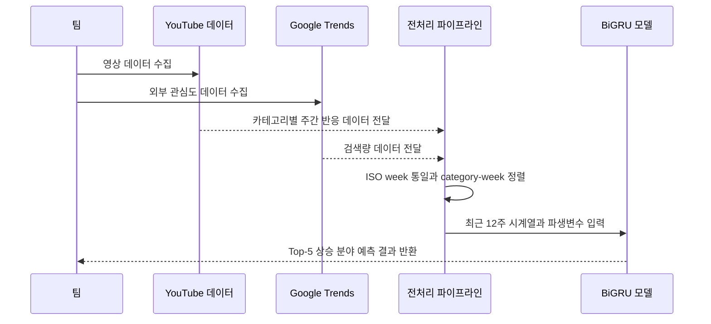

# 프로젝트 일대기

이 프로젝트는 처음부터 BiGRU를 정해 두고 시작한 작업이 아니었다. 출발점은 더 단순했다. 유튜브에서 앞으로 어떤 분야가 더 주목받을지, 그 질문을 데이터로 설명해 보고 싶었다.

## 한 문장으로 보면

개별 영상의 virality 예측에서 출발했지만, 실제 작업을 하면서 문제를 카테고리 단위 상승 예측으로 다시 정의했고, 그에 맞춰 데이터 구조와 모델 구조를 새로 세운 프로젝트였다.

## 흐름 요약

## 1. 시작은 개별 영상 예측이었다

처음에는 자연스럽게 영상 단위 신호부터 보았다.

- 조회수
- 좋아요
- 댓글
- 제목
- 태그
- 업로드 시각

이 정도 정보면 잘 될 영상을 어느 정도는 예측할 수 있을 것 같았다. 실제로 많은 virality 예측도 이 흐름에서 출발한다.

하지만 데이터를 정리할수록 한계가 분명해졌다. 비슷한 초기 반응을 보인 영상도 어떤 카테고리 흐름 위에 있는지에 따라 의미가 달랐다. 그래서 질문을 어떤 영상이 잘 될까보다 어떤 분야가 앞으로 더 올라갈까로 바꾸게 되었다.

이 전환이 프로젝트 전체를 바꾼 첫 번째 지점이었다.

## 2. 질문을 바꾸자 프로젝트가 풀리기 시작했다

질문을 바꾸고 나서 프로젝트의 중심은 개별 영상에서 카테고리 흐름으로 이동했다.

우리가 세운 가정은 아래와 같았다.

1. 분야마다 기본 체력과 반응 구조가 다르다.
2. 영상 성과는 그 카테고리의 전체 분위기와 분리해서 보기 어렵다.
3. 최근 반응은 중요하지만, 카테고리 흐름 위에서 읽을 때 더 의미가 커진다.

즉 이 프로젝트는 단순한 virality 예측이 아니라, 카테고리 트렌드와 최근 12주 시계열, 외부 변수를 함께 보는 문제로 다시 정의되었다.

## 3. 실제로 가장 오래 걸린 것은 데이터 정합성이었다

모델보다 더 오래 붙잡고 있었던 건 데이터였다. 특히 서로 다른 기준으로 모인 파일을 같은 주차 축 위에 올리는 일이 가장 어려웠다.

| 문제 | 왜 어려웠는가 | 어떻게 해결했는가 |
|---|---|---|
| Google Trends 파일 구조 불안정 | 수집 배치마다 형식과 정리 상태가 달라 바로 병합하기 어려웠다 | active category 기준으로 다시 정리하고 병합 파이프라인을 별도로 만들었다 |
| `year_week` 해석 차이 | 겉보기에는 같은 주차처럼 보여도 실제 날짜로 복원하면 어긋나는 경우가 있었다 | ISO week 기준으로 다시 맞추고 `week_date`를 명시적으로 생성했다 |
| 분야별 분포 불균형 | 활동량이 거의 없거나 표본 수가 적은 분야까지 함께 넣으면 흐름이 불안정해졌다 | 학습 대상을 먼저 active 16개 분야로 정리하고, 발표와 최종 평가는 핵심 10개 분야로 고정했다 |

이 과정에서 확인한 건 단순했다. 데이터가 많다는 사실보다, 서로 다른 데이터가 같은 시간축과 같은 단위로 정렬되어 있느냐가 더 중요했다.

## 4. 핵심 10개 분야로 줄인 것은 성능 포장이 아니라 재설계였다

처음 목표는 더 넓은 범위의 유튜브 분야를 다루는 것이었다. 하지만 실제 데이터는 분야마다 표본 수, 최근 활동량, 결측 정도, 시계열 길이가 크게 달랐다.

그래서 최종적으로는 아래 두 단계를 거쳤다.

- 활동량과 연속성이 충분한 16개 분야를 학습 대상 범위로 정리
- 발표와 최종 평가에서는 핵심 10개 분야를 기준으로 고정

이 선택은 범위를 줄여 숫자를 좋게 보이려는 의도가 아니라, 예측 가능한 범위 안에서 더 일관된 문제를 만드는 과정에 가까웠다. 다시 말해 이 프로젝트는 전체 유튜브를 한 번에 설명하려 한 것이 아니라, 데이터가 안정적으로 쌓인 핵심 분야 안에서 상승 가능성을 선별하는 문제를 만들었다.

## 5. 그래서 최종 모델도 그 문제에 맞춰 바뀌었다

최종 모델 설명은 네 단계로 정리할 수 있었다.

1. 최근 12주 카테고리 시계열과 외부 변수를 입력으로 받는다.
2. category embedding으로 분야별 고유 특성을 반영한다.
3. BiGRU가 최근 흐름의 방향성과 변화를 읽는다.
4. 상승 확률과 순위 상승 확률을 함께 계산해 Top-N을 선별한다.

중요한 점은 모델 이름 자체보다, 무엇을 먼저 보고 무엇을 나중에 결합하느냐였다. 이 프로젝트는 원시 영상 데이터를 바로 분류하는 구조가 아니라, category-week 단위로 정리된 흐름 위에서 상승 신호를 읽는 구조로 정리되었다.

## 6. 왜 RNN 계열에서 BiGRU를 골랐는가

최종 모델은 RNN 계열의 표준 시계열 딥러닝 구조인 BiGRU를 기반으로 했다.

- RNN은 순차 데이터를 시간 순서대로 읽는 기본 구조다.
- GRU는 RNN보다 장기 의존성 학습에 유리하면서 구조가 더 가볍다.
- BiGRU는 GRU를 양방향으로 확장해 짧은 시계열 안의 전후 문맥을 함께 읽을 수 있다.

우리 문제는 최근 12주 안에서 상승 조짐, 둔화, 회복 흐름을 함께 읽는 것이 중요했다. 그래서 너무 복잡한 구조보다는, 현재 데이터 규모에서 안정적으로 시계열 방향성을 학습할 수 있는 BiGRU가 가장 자연스러운 선택이었다.

## 7. 발표를 준비하면서 더 중요해진 것

발표 직전에는 모델 성능 숫자보다 설명의 구체성이 더 중요해졌다. 특히 아래 항목이 정리되어야 발표가 훨씬 설득력 있게 바뀌었다.

- 정확히 무엇을 예측하는가
- 왜 전체가 아니라 핵심 10개 분야인가
- `rise_label`과 `rank_up`은 어떻게 정의했는가
- 왜 Accuracy와 Precision@5를 함께 봐야 하는가
- 결과를 어떻게 과장하지 않고 해석할 것인가

그래서 이 저장소에는 결과 표만 남긴 것이 아니라, 변수 설명 문서, 평가 지표 문서, 발표 Q&A 문서까지 함께 정리해 두었다.

## 이 프로젝트가 남긴 것

이 프로젝트에서 남은 핵심은 성능 수치 하나가 아니었다.

- 개별 영상 중심 질문을 카테고리 상승 예측 문제로 바꾸는 과정
- 데이터 정합성을 해결한 뒤에야 모델이 의미를 가진다는 점
- 전체 범위를 고집하기보다, 예측 가능한 범위를 분명히 정하는 일이 중요하다는 점
- 딥러닝 모델만큼이나 문제 정의와 결과 해석이 중요하다는 점

즉 이 프로젝트는 딥러닝 모델 하나를 적용해 본 기록이라기보다, 예측 문제를 다시 세우고 그에 맞는 데이터와 구조를 만들어 본 과정에 더 가깝다.

## 한 문장 요약

이 프로젝트는 개별 영상 virality 예측의 한계에서 출발해, 카테고리 트렌드와 최근 12주 시계열, 외부 변수를 함께 활용해 유튜브 핵심 10개 분야의 향후 4주 상승 가능성을 예측하는 BiGRU 기반 구조로 발전해 간 과정을 담은 프로젝트다.