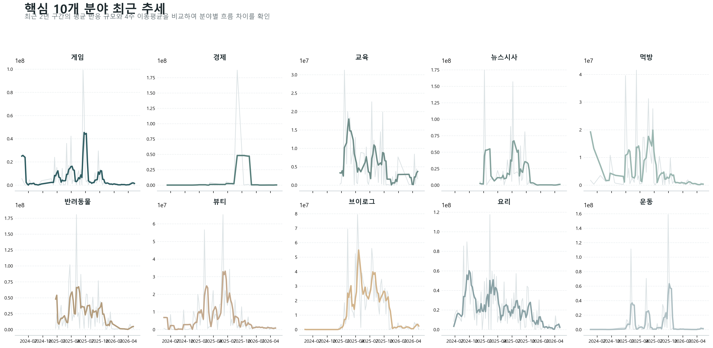
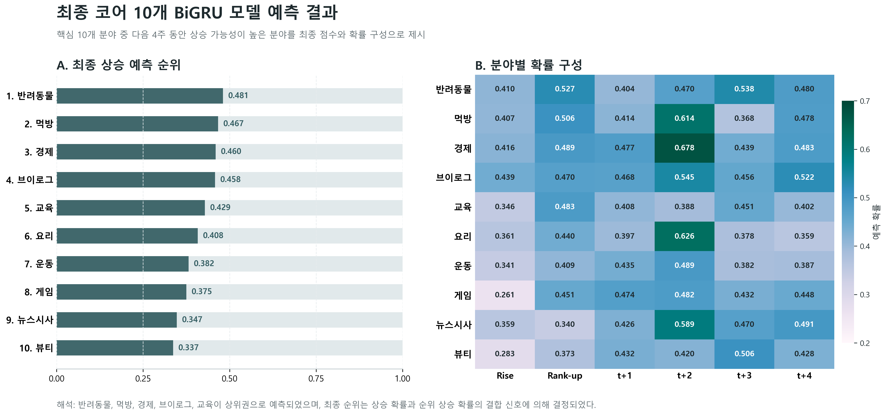

# 유튜브 트렌드 분야 예측 프로젝트


과거 카테고리 추세, 최근 12주 시계열 반응, Google Trends 검색량, 캘린더 변수를 함께 사용해 **유튜브 핵심 10개 분야의 향후 4주 상승 가능성**을 예측한 딥러닝 프로젝트입니다.

이 저장소는 결과만 정리한 보관소라기보다, **데이터가 어디서 틀어졌고 그 문제를 어떻게 고쳐 나갔는지까지 남겨두는 기록**에 가깝습니다.

## 한눈에 보기

- **문제**: 어떤 유튜브 분야가 앞으로 더 올라갈까?
- **최종 목표**: 핵심 10개 분야 안에서 **Top-5 상승 분야 선별**
- **최종 모델**: `BiGRU` 기반 시계열 딥러닝 모델
- **예측 기간**: 다음 4주
- **예측 대상**: `게임`, `경제`, `교육`, `뉴스시사`, `먹방`, `반려동물`, `뷰티`, `브이로그`, `요리`, `운동`

## 핵심 결과

- 분류 성능: Accuracy `0.767`, F1-score `0.829`, ROC AUC `0.845`
- Top-5 선별 성능: Precision@5 `0.900`, NDCG@5 `0.881`
- 최종 Top-5 상승 예측 분야: `반려동물`, `먹방`, `경제`, `브이로그`, `교육`

## 왜 이 프로젝트를 남겨두는가

이 프로젝트에서 더 어려웠던 건 모델보다 데이터였다.

- Google Trends 수집이 안정적으로 되지 않았고
- `%Y-%U`와 ISO week가 섞이면서 주차 축이 어긋났고
- 전체 20개 분야를 한 번에 다루자 sparse category 때문에 성능이 흔들렸다

결국 핵심은 “더 복잡한 모델을 쓰는 것”보다 **문제를 다시 정의하고, 데이터 축을 바로잡고, 예측 가능한 범위로 줄이는 것**이었다.  
이 저장소는 그 과정을 그대로 남겨두는 데 목적이 있다.

이 저장소에서 남기고 싶은 건 “성능이 얼마 나왔는가” 자체보다,  
**문제 정의를 어떻게 바꿨는지, 데이터 오류를 어떻게 고쳤는지, 그리고 최종적으로 어떤 모델과 결과를 남겼는지**다.

## 대표 시각화

### 1. 핵심 10개 분야 최근 추세



최근 2년 동안 분야별 반응 흐름이 비슷하게 움직이지 않았다는 점을 보여준다.  
즉, 이 문제는 전체 평균보다 **카테고리별 시계열 패턴**을 따로 봐야 풀린다.

### 2. 최종 예측 결과 요약



최종 예측 결과는 단순 조회수 규모가 아니라, 최근 반응, 검색량, 순위 상승 신호를 함께 반영한 결과다.

## 어디부터 읽으면 좋은가

- 프로젝트 흐름부터 보고 싶다면: [PROJECT_JOURNEY.md](./PROJECT_JOURNEY.md)
- 실제로 어디서 문제가 났는지 보고 싶다면: [TROUBLESHOOTING.md](./TROUBLESHOOTING.md)
- 최종 모델 구조부터 보고 싶다면: [FINAL_MODEL.md](./FINAL_MODEL.md)
- 최종 성능과 예측 결과부터 보고 싶다면: [RESULTS.md](./RESULTS.md)
- 실행 순서가 궁금하다면: [RUN_PROJECT.md](./RUN_PROJECT.md)
- 공개 저장소 기준 재현 범위가 궁금하다면: [REPRODUCIBILITY.md](./REPRODUCIBILITY.md)

## 공개 저장소 구조

```text
.
├─ youtube_trend_project_pipeline.executed.ipynb   # 메인 프로젝트 노트북
├─ train_active_category_rank_bigru.py             # 최종 BiGRU 학습 코드
├─ run_core10_top_predictions.py                   # 최종 예측 재생성 코드
├─ make_paper_visualization_suite.py               # 대표 시각화 생성 코드
├─ plot_core10_prediction_results.py               # 예측 결과 시각화 코드
├─ plot_core10_prediction_story.py                 # 예측 스토리 시각화 코드
├─ README.md                                       # 저장소 첫 화면
├─ PROJECT_JOURNEY.md                              # 프로젝트 일대기
├─ TROUBLESHOOTING.md                              # 문제와 해결 과정
├─ FINAL_MODEL.md                                  # 최종 모델 설명
├─ RESULTS.md                                      # 최종 성능과 예측 결과
├─ RUN_PROJECT.md                                  # 실행 안내
├─ REPRODUCIBILITY.md                              # 재현 범위와 한계
├─ requirements.txt                                # 공개용 기본 실행 패키지
├─ docs/assets/                                    # 문서용 대표 이미지
└─ project_ready_data/model_outputs/               # 공개 가능한 최종 결과 파일 일부
```

실제 로컬 작업 폴더에는 이보다 더 많은 보조 스크립트와 산출물이 있었지만,  
공개 저장소에는 **프로젝트를 이해하는 데 필요한 핵심 파일만 선별해서 올렸다.**

## 빠르게 시작하는 방법

### 환경

- Python 3.11+ 권장
- Windows 환경 기준으로 정리
- GPU가 있으면 빠르지만, 결과 확인 정도는 CPU로도 가능

### 설치

```bash
pip install -r requirements.txt
```

처음 보는 사람에게 가장 추천하는 순서는 아래와 같다.

1. [RESULTS.md](./RESULTS.md)로 최종 결과 확인
2. [FINAL_MODEL.md](./FINAL_MODEL.md)로 모델 구조 확인
3. [PROJECT_JOURNEY.md](./PROJECT_JOURNEY.md)와 [TROUBLESHOOTING.md](./TROUBLESHOOTING.md)로 일대기 확인
4. [RUN_PROJECT.md](./RUN_PROJECT.md), [REPRODUCIBILITY.md](./REPRODUCIBILITY.md)로 실행 범위 확인

공개 저장소에는 대용량 산출물과 중간 결과가 대부분 빠져 있다.  
실행 순서와 파일 의존성은 [RUN_PROJECT.md](./RUN_PROJECT.md)에,  
공개 저장소에서 어디까지 재현 가능한지는 [REPRODUCIBILITY.md](./REPRODUCIBILITY.md)에 따로 정리해두었다.

## 한 줄 요약

이 프로젝트는 **유튜브 핵심 10개 분야의 향후 4주 상승 가능성을 예측하기 위해, 데이터 오류를 직접 고치고 문제를 다시 정의한 뒤 최종적으로 BiGRU 기반 Top-5 선별 모델까지 정리한 경험 기록형 딥러닝 프로젝트**다.
