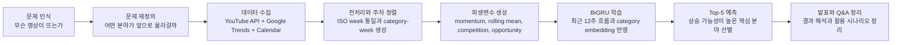

# 유튜브 분야 상승 예측 프로젝트


최근 12주 반응 시계열, Google Trends, 캘린더 변수를 함께 사용해 핵심 10개 유튜브 분야 중 다음 4주 동안 더 올라갈 가능성이 높은 Top-5 분야를 예측한 딥러닝 프로젝트입니다.

이 저장소는 결과만 올려 둔 공간이 아니라, 문제를 어떻게 다시 정의했는지, 데이터 정합성 문제를 어떻게 풀었는지, 왜 BiGRU를 선택했는지, 그리고 최종 발표와 Q&A까지 어떻게 정리했는지를 함께 남겨 둔 작업 기록입니다.

## 30초 요약

| 항목 | 내용 |
|---|---|
| 목표 | 핵심 10개 유튜브 분야 중 향후 4주 상승 가능성이 높은 Top-5 분야 예측 |
| 입력 | 최근 12주 카테고리 시계열, Google Trends, 캘린더 변수, category embedding |
| 모델 | RNN 계열의 표준 시계열 딥러닝 모델인 BiGRU |
| 출력 | 상승 확률, 순위 상승 확률, 최종 Top-N 선별 |
| 최종 Top-5 | 반려동물, 먹방, 경제, 브이로그, 교육 |

## 이 저장소가 보여주는 것

- 개별 영상 예측에서 카테고리 단위 상승 예측으로 문제를 다시 정의한 과정
- 주차 불일치, Google Trends 병합, 범주 축소 같은 데이터 정합성 해결 과정
- BiGRU 기반 시계열 모델로 Top-N 선별 문제를 푼 구조
- 발표 자료, Q&A, 재현 문서까지 포함한 포트폴리오형 프로젝트 정리

## 바로 보기

- 발표 자료: [딥러닝 발표 PPT.pdf](./딥러닝%20발표%20PPT.pdf)
- 예상 질문 표: [QnA_Report.pdf](./QnA_Report.pdf)
- 발표용 답변 정리: [PRESENTATION_QNA.md](./PRESENTATION_QNA.md)
- 모델 설명: [FINAL_MODEL.md](./FINAL_MODEL.md)
- 결과 정리: [RESULTS.md](./RESULTS.md)
- 프로젝트 스토리: [PROJECT_JOURNEY.md](./PROJECT_JOURNEY.md)
- 영어 문서 시작점: [PROJECT_JOURNEY_EN.md](./PROJECT_JOURNEY_EN.md)

## 프로젝트 흐름



## 문제 정의

처음에는 개별 영상의 virality를 맞히는 방향으로 접근했습니다. 하지만 실제로는 영상 하나의 초기 반응만으로 미래 관심 흐름을 설명하기 어렵다고 판단했고, 질문을 어떤 영상이 잘 될까에서 어떤 분야가 앞으로 더 주목받을까로 바꾸었습니다.

최종 문제 정의는 아래와 같습니다.

> 최근 12주간의 유튜브 반응 데이터, Google Trends, 캘린더 변수를 활용하여 핵심 10개 유튜브 분야 중 다음 4주 동안 상승 가능성이 높은 Top-5 분야를 예측한다.

## 데이터와 변수

이 프로젝트는 세 종류의 데이터를 함께 사용했습니다.

- YouTube Data API 기반 영상 메타데이터와 반응 지표
- 카테고리별 주간 추세 데이터
- Google Trends와 공휴일, 연휴, 방학, 시험기간 같은 캘린더 변수

대표 파생변수는 `rolling_4week_mean`, `momentum_ratio`, `competition_score`, `opportunity_score`이며, 정답 라벨은 `rise_label`, `rank_up`으로 구성했습니다.

자세한 기준은 아래 문서에 정리했습니다.

- [DATA_VARIABLE_GUIDE.md](./DATA_VARIABLE_GUIDE.md)
- [DATA_PIPELINE_CODE_INDEX.md](./DATA_PIPELINE_CODE_INDEX.md)

## 모델과 선택 이유

최종 모델은 RNN 계열에서 GRU를 양방향으로 확장한 BiGRU입니다. 최근 12주처럼 길지 않은 시계열 안에서 상승, 둔화, 회복 흐름을 함께 읽는 것이 중요했기 때문에, 비교적 가볍고 시계열 문맥을 안정적으로 학습할 수 있는 구조가 필요했습니다.

모델은 다음 순서로 작동합니다.

1. 카테고리별 최근 12주 시계열과 외부 변수를 입력으로 받습니다.
2. category embedding으로 분야별 고유 특성을 함께 반영합니다.
3. BiGRU가 최근 흐름의 방향성을 학습합니다.
4. 상승 확률과 순위 상승 확률을 함께 산출해 최종 Top-N을 선별합니다.

모델 구조 설명은 [FINAL_MODEL.md](./FINAL_MODEL.md)에 정리했습니다.

## 핵심 결과

### 분류 성능

| Metric | Score |
|---|---:|
| Accuracy | 0.767 |
| Balanced Accuracy | 0.798 |
| Precision | 0.944 |
| Recall | 0.739 |
| F1-score | 0.829 |
| ROC AUC | 0.845 |

### Top-5 선별 성능

| Metric | Score |
|---|---:|
| Precision@5 | 0.900 |
| Recall@5 | 0.801 |
| HitRate@5 | 1.000 |
| NDCG@5 | 0.881 |

### 최종 Top-5 예측 분야

1. 반려동물
2. 먹방
3. 경제
4. 브이로그
5. 교육

여기서 중요한 점은 이 결과가 지금 가장 큰 분야를 그대로 고른 것이 아니라, 최근 반응 흐름과 검색 관심도, 상대 순위 변화를 함께 반영해 앞으로 더 올라갈 가능성이 있는 분야를 선별한 결과라는 점입니다.

결과 해석은 [RESULTS.md](./RESULTS.md), 지표 의미는 [EVALUATION_GUIDE.md](./EVALUATION_GUIDE.md)에서 볼 수 있습니다.

## 이번 프로젝트에서 어려웠던 점

- `year_week` 기준이 파일마다 달라 ISO week로 다시 맞춰야 했습니다.
- Google Trends 수집 결과를 바로 모델에 넣기 어려워 별도 정리 파이프라인이 필요했습니다.
- 모든 분야를 한 번에 다루면 분포가 불안정해 활동량과 연속성이 충분한 핵심 10개 분야로 문제를 다시 정의했습니다.

이 과정을 더 자세히 적어 둔 문서는 [PROJECT_JOURNEY.md](./PROJECT_JOURNEY.md)와 [TROUBLESHOOTING.md](./TROUBLESHOOTING.md)입니다.

## 문서 읽는 순서

1. [README.md](./README.md)
2. [딥러닝 발표 PPT.pdf](./딥러닝%20발표%20PPT.pdf)
3. [PROJECT_JOURNEY.md](./PROJECT_JOURNEY.md)
4. [FINAL_MODEL.md](./FINAL_MODEL.md)
5. [RESULTS.md](./RESULTS.md)
6. [PRESENTATION_QNA.md](./PRESENTATION_QNA.md)

## 저장소 안 핵심 파일

```text
.
├─ 딥러닝 발표 PPT.pdf
├─ QnA_Report.pdf
├─ youtube_trend_project_pipeline.executed.ipynb
├─ train_active_category_rank_bigru.py
├─ run_core10_top_predictions.py
├─ make_paper_visualization_suite.py
├─ PROJECT_JOURNEY.md
├─ FINAL_MODEL.md
├─ RESULTS.md
├─ PRESENTATION_QNA.md
├─ DATA_VARIABLE_GUIDE.md
├─ EVALUATION_GUIDE.md
└─ docs/assets/
```

## 실행과 재현

```bash
pip install -r requirements.txt
```

실행 순서와 재현 범위는 아래 문서를 참고하면 됩니다.

- [RUN_PROJECT.md](./RUN_PROJECT.md)
- [REPRODUCIBILITY.md](./REPRODUCIBILITY.md)

## 한 줄 정리

이 저장소는 유튜브 핵심 10개 분야의 향후 4주 상승 가능성을 최근 12주 시계열과 외부 변수, BiGRU 기반 딥러닝 모델로 예측하고, 그 과정을 발표 자료와 Q&A까지 포함해 정리한 프로젝트 기록입니다.